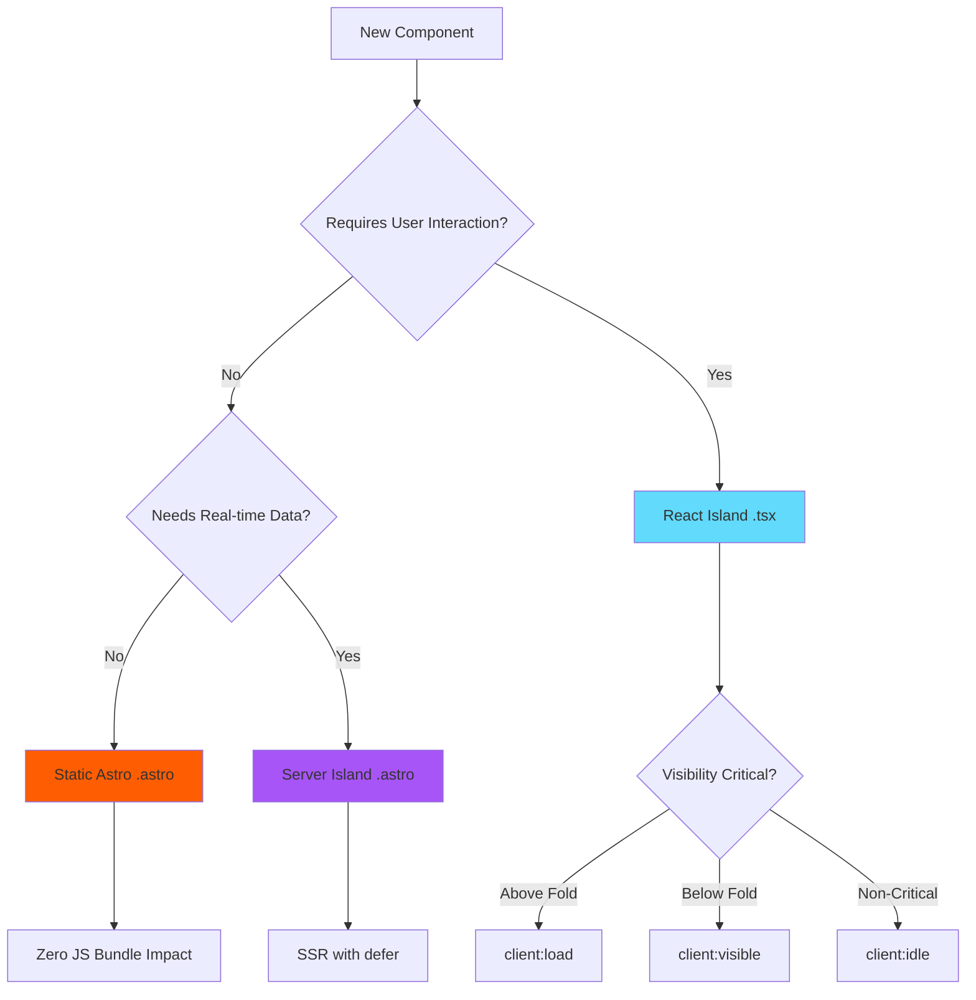
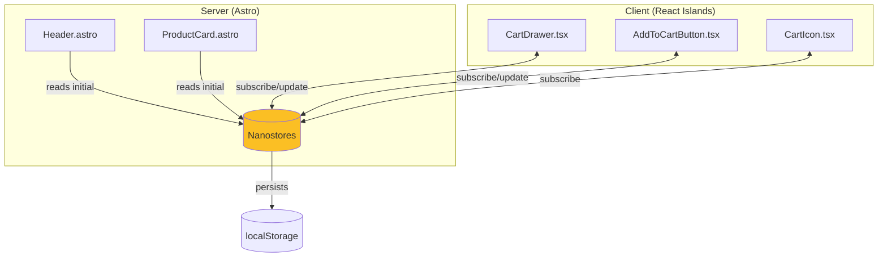

# boba-commerce: Frontend Architecture Specification

> **Version:** 1.0.0  
> **Last Updated:** 2024-12-30  
> **Author:** Principal Software Architect  
> **Status:** Draft - Pending Review

---

## Table of Contents

1. [Overview](#1-overview)
2. [Project Structure](#2-project-structure)
3. [Component Strategy: The Hybrid Model](#3-component-strategy-the-hybrid-model)
4. [State Management Architecture](#4-state-management-architecture)
5. [Design System & UI](#5-design-system--ui)
6. [Performance Budget](#6-performance-budget)

---

## 1. Overview

### 1.1 Architectural Philosophy

boba-commerce implements the **Island Architecture** pattern, treating interactive components as isolated "islands" of JavaScript hydration within a sea of static HTML. This approach prioritizes:

- **Performance First**: Zero JavaScript by default; opt-in interactivity
- **Progressive Enhancement**: Core functionality works without JS
- **SEO Optimization**: Full SSR with proper semantic HTML
- **Developer Experience**: Clear separation of concerns

### 1.2 Framework Justification

| Technology | Purpose | Rationale |
|-----------|---------|-----------|
| **Astro 5.0** | Meta-framework | SSR, Island Architecture, Actions API |
| **React 18** | Interactive Islands | Ecosystem maturity, concurrent features |
| **Tailwind CSS** | Styling | Utility-first, tree-shaking, design tokens |
| **Nanostores** | State Management | Framework-agnostic, minimal footprint (~1KB) |

---

## 2. Project Structure

### 2.1 Directory Architecture

We adopt a **Hybrid Feature-First** structure that balances modularity with Astro's conventions:

```
boba-commerce/
├── src/
│   ├── actions/                    # Astro Server Actions
│   │   ├── auth.ts                 # Authentication mutations
│   │   ├── cart.ts                 # Cart operations
│   │   ├── checkout.ts             # Order processing
│   │   └── index.ts                # Action barrel exports
│   │
│   ├── components/
│   │   ├── astro/                  # Server-only components (.astro)
│   │   │   ├── layout/
│   │   │   │   ├── Header.astro
│   │   │   │   ├── Footer.astro
│   │   │   │   └── Navigation.astro
│   │   │   ├── product/
│   │   │   │   ├── ProductCard.astro
│   │   │   │   ├── ProductGrid.astro
│   │   │   │   └── ProductMeta.astro
│   │   │   └── common/
│   │   │       ├── SEOHead.astro
│   │   │       ├── Breadcrumb.astro
│   │   │       └── ErrorBoundary.astro
│   │   │
│   │   ├── react/                  # Client Islands (.tsx)
│   │   │   ├── cart/
│   │   │   │   ├── CartDrawer.tsx
│   │   │   │   ├── CartItem.tsx
│   │   │   │   ├── CartSummary.tsx
│   │   │   │   └── AddToCartButton.tsx
│   │   │   ├── product/
│   │   │   │   ├── ProductGallery.tsx
│   │   │   │   ├── VariantSelector.tsx
│   │   │   │   └── QuantityInput.tsx
│   │   │   ├── checkout/
│   │   │   │   ├── CheckoutForm.tsx
│   │   │   │   ├── PaymentWidget.tsx
│   │   │   │   └── OrderSummary.tsx
│   │   │   ├── auth/
│   │   │   │   ├── LoginForm.tsx
│   │   │   │   ├── RegisterForm.tsx
│   │   │   │   └── UserMenu.tsx
│   │   │   └── ui/                 # Primitive UI components
│   │   │       ├── Button.tsx
│   │   │       ├── Input.tsx
│   │   │       ├── Modal.tsx
│   │   │       ├── Toast.tsx
│   │   │       ├── Skeleton.tsx
│   │   │       └── index.ts
│   │   │
│   │   └── server-islands/         # Astro Server Islands (dynamic SSR)
│   │       ├── UserProfileWidget.astro
│   │       ├── RecentlyViewed.astro
│   │       └── DynamicBanner.astro
│   │
│   ├── layouts/
│   │   ├── BaseLayout.astro        # Root HTML structure
│   │   ├── ShopLayout.astro        # E-commerce pages wrapper
│   │   ├── CheckoutLayout.astro    # Minimal checkout layout
│   │   └── AdminLayout.astro       # Dashboard layout
│   │
│   ├── pages/
│   │   ├── index.astro             # Homepage
│   │   ├── products/
│   │   │   ├── index.astro         # Product listing
│   │   │   └── [slug].astro        # Product detail (SSR)
│   │   ├── cart.astro              # Cart page
│   │   ├── checkout/
│   │   │   ├── index.astro         # Checkout flow
│   │   │   └── success.astro       # Order confirmation
│   │   ├── account/
│   │   │   ├── index.astro         # Account dashboard
│   │   │   ├── orders.astro        # Order history
│   │   │   └── settings.astro      # User settings
│   │   ├── auth/
│   │   │   ├── login.astro
│   │   │   ├── register.astro
│   │   │   └── callback.astro      # OAuth callback
│   │   ├── admin/                  # Protected admin routes
│   │   │   ├── index.astro
│   │   │   ├── products/
│   │   │   └── orders/
│   │   └── api/                    # REST endpoints (if needed)
│   │       └── [...path].ts
│   │
│   ├── lib/
│   │   ├── db/                     # Database layer
│   │   │   ├── client.ts           # Drizzle client
│   │   │   ├── schema/             # Drizzle schema definitions
│   │   │   └── queries/            # Query functions (DAL)
│   │   ├── stores/                 # Nanostores definitions
│   │   │   ├── cart.ts
│   │   │   ├── auth.ts
│   │   │   ├── ui.ts
│   │   │   └── index.ts
│   │   ├── utils/                  # Utility functions
│   │   │   ├── format.ts           # Currency, date formatting
│   │   │   ├── validation.ts       # Shared Zod schemas
│   │   │   └── seo.ts              # SEO helpers
│   │   └── supabase/               # Supabase client & auth
│   │       ├── client.ts
│   │       └── auth.ts
│   │
│   ├── styles/
│   │   ├── global.css              # Base styles, CSS resets
│   │   └── fonts.css               # Font-face declarations
│   │
│   └── types/
│       ├── product.ts
│       ├── cart.ts
│       ├── order.ts
│       └── index.ts
│
├── public/
│   ├── fonts/
│   ├── images/
│   └── favicon.svg
│
├── drizzle/                        # Migration files
│   └── migrations/
│
├── astro.config.mjs
├── tailwind.config.mjs
├── drizzle.config.ts
├── tsconfig.json
└── package.json
```

### 2.2 Import Aliases

Configure TypeScript path aliases for clean imports:

```json
// tsconfig.json
{
  "compilerOptions": {
    "baseUrl": ".",
    "paths": {
      "@/*": ["src/*"],
      "@components/*": ["src/components/*"],
      "@lib/*": ["src/lib/*"],
      "@stores/*": ["src/lib/stores/*"],
      "@actions/*": ["src/actions/*"]
    }
  }
}
```

---

## 3. Component Strategy: The Hybrid Model

### 3.1 Decision Framework



### 3.2 Component Classification Rules

| Component Type | Extension | Hydration | Use Cases |
|---------------|-----------|-----------|-----------|
| **Static Server** | `.astro` | None | Headers, Footers, Product Cards, SEO elements |
| **Interactive Island** | `.tsx` | Configurable | Forms, Carts, Galleries, Modals |
| **Server Island** | `.astro` | `server:defer` | User-specific content, A/B tests |

### 3.3 Hydration Directive Strategy

#### 3.3.1 `client:load` - Immediate Hydration

**When to use:** Components that must be interactive immediately upon page load.

```astro
---
// Header.astro
import { CartIcon } from '@components/react/cart/CartIcon';
---

<header>
  <nav>...</nav>
  <!-- Cart icon needs immediate interactivity for count updates -->
  <CartIcon client:load />
</header>
```

**Target Components:**
- `CartIcon` (header) - Displays live count
- `SearchBar` - Above-fold, primary interaction
- `MobileMenu` - Navigation accessibility
- `Toast` container - System notifications

#### 3.3.2 `client:idle` - Deferred Hydration

**When to use:** Interactive but not immediately critical. Hydrates when browser is idle.

```astro
---
// ProductCard.astro
import { AddToCartButton } from '@components/react/cart/AddToCartButton';
---

<article class="product-card">
  
  <h3>{product.name}</h3>
  <!-- User won't click immediately; defer hydration -->
  <AddToCartButton client:idle productId={product.id} />
</article>
```

**Target Components:**
- `AddToCartButton` - User needs time to browse
- `WishlistButton` - Secondary action
- `NewsletterForm` - Footer subscription
- `ChatWidget` - Support chat

#### 3.3.3 `client:visible` - Viewport-Triggered Hydration

**When to use:** Below-fold interactive components. Hydrate only when scrolled into view.

```astro
---
// ProductDetail.astro
import { ProductGallery } from '@components/react/product/ProductGallery';
import { ReviewSection } from '@components/react/product/ReviewSection';
---

<main>
  <!-- Gallery is above fold, needs immediate interaction -->
  <ProductGallery client:load images={product.images} />
  
  <ProductInfo product={product} />
  
  <!-- Reviews are below fold -->
  <ReviewSection client:visible productId={product.id} />
</main>
```

**Target Components:**
- `ProductGallery` (if below fold) - Image carousel/zoom
- `ReviewSection` - User reviews with pagination
- `RelatedProducts` carousel - Recommendation slider
- `FAQAccordion` - Expandable content

#### 3.3.4 Component Hydration Matrix

| Component | Directive | Justification |
|-----------|-----------|---------------|
| `CartDrawer` | `client:load` | Must respond to cart icon click immediately |
| `CartIcon` | `client:load` | Displays real-time cart count in header |
| `ProductGallery` | `client:load` | Primary product interaction, above fold |
| `VariantSelector` | `client:load` | Core purchase flow component |
| `AddToCartButton` | `client:idle` | Users browse before adding |
| `Toast` | `client:load` | System feedback must be immediate |
| `SearchAutocomplete` | `client:idle` | Defer until user focuses |
| `UserMenu` | `client:idle` | Secondary navigation |
| `ReviewList` | `client:visible` | Below fold, lazy load |
| `ImageZoom` | `client:visible` | Triggered interaction |

### 3.4 Server Islands Configuration

For personalized content that shouldn't block initial render:

```astro
---
// ShopLayout.astro
---
<html>
  <body>
    <Header />
    
    <!-- Defer user-specific content -->
    <UserProfileWidget server:defer>
      <div slot="fallback" class="skeleton-avatar" />
    </UserProfileWidget>
    
    <slot />
    <Footer />
  </body>
</html>
```

---

## 4. State Management Architecture

### 4.1 Nanostores Strategy

Nanostores provides a framework-agnostic, minimal state solution that works seamlessly between Astro components and React islands.



### 4.2 Store Definitions

```typescript
// src/lib/stores/cart.ts
import { atom, map, computed } from 'nanostores';
import type { CartItem, Product } from '@/types';

// Atomic store for cart open/close state
export const $isCartOpen = atom<boolean>(false);

// Map store for cart items (key: variantId)
export const $cartItems = map<Record<string, CartItem>>({});

// Computed store for derived values
export const $cartCount = computed($cartItems, (items) => 
  Object.values(items).reduce((sum, item) => sum + item.quantity, 0)
);

export const $cartTotal = computed($cartItems, (items) =>
  Object.values(items).reduce(
    (sum, item) => sum + item.price * item.quantity, 
    0
  )
);

// Actions
export function addToCart(product: Product, quantity: number = 1) {
  const currentItems = $cartItems.get();
  const existingItem = currentItems[product.variantId];
  
  if (existingItem) {
    $cartItems.setKey(product.variantId, {
      ...existingItem,
      quantity: existingItem.quantity + quantity
    });
  } else {
    $cartItems.setKey(product.variantId, {
      productId: product.id,
      variantId: product.variantId,
      name: product.name,
      price: product.price,
      image: product.image,
      quantity,
      customizations: product.customizations
    });
  }
  
  // Persist to localStorage
  persistCart();
}

export function removeFromCart(variantId: string) {
  const current = { ...$cartItems.get() };
  delete current[variantId];
  $cartItems.set(current);
  persistCart();
}

export function updateQuantity(variantId: string, quantity: number) {
  if (quantity <= 0) {
    removeFromCart(variantId);
    return;
  }
  
  const item = $cartItems.get()[variantId];
  if (item) {
    $cartItems.setKey(variantId, { ...item, quantity });
    persistCart();
  }
}

// Persistence
function persistCart() {
  if (typeof window !== 'undefined') {
    localStorage.setItem('boba-cart', JSON.stringify($cartItems.get()));
  }
}

export function hydrateCart() {
  if (typeof window !== 'undefined') {
    const stored = localStorage.getItem('boba-cart');
    if (stored) {
      try {
        $cartItems.set(JSON.parse(stored));
      } catch (e) {
        console.error('Failed to hydrate cart:', e);
      }
    }
  }
}
```

```typescript
// src/lib/stores/auth.ts
import { atom, computed } from 'nanostores';
import type { User } from '@supabase/supabase-js';

export const $user = atom<User | null>(null);
export const $isAuthenticated = computed($user, (user) => user !== null);
export const $userRole = computed($user, (user) => 
  user?.user_metadata?.role ?? 'customer'
);

export function setUser(user: User | null) {
  $user.set(user);
}
```

```typescript
// src/lib/stores/ui.ts
import { atom } from 'nanostores';

// Toast notifications
export type Toast = {
  id: string;
  type: 'success' | 'error' | 'info' | 'warning';
  message: string;
  duration?: number;
};

export const $toasts = atom<Toast[]>([]);

export function addToast(toast: Omit<Toast, 'id'>) {
  const id = crypto.randomUUID();
  const newToast = { ...toast, id };
  
  $toasts.set([...$toasts.get(), newToast]);
  
  // Auto-remove after duration
  setTimeout(() => {
    removeToast(id);
  }, toast.duration ?? 5000);
  
  return id;
}

export function removeToast(id: string) {
  $toasts.set($toasts.get().filter(t => t.id !== id));
}

// Mobile menu state
export const $isMobileMenuOpen = atom<boolean>(false);

// Search state
export const $isSearchOpen = atom<boolean>(false);
export const $searchQuery = atom<string>('');
```

### 4.3 React Integration Pattern

```tsx
// src/components/react/cart/CartIcon.tsx
import { useStore } from '@nanostores/react';
import { $cartCount, $isCartOpen } from '@stores/cart';

export function CartIcon() {
  const count = useStore($cartCount);
  const isOpen = useStore($isCartOpen);
  
  return (
    <button 
      onClick={() => $isCartOpen.set(!isOpen)}
      className="relative p-2"
      aria-label={`Cart with ${count} items`}
    >
      <ShoppingBagIcon className="h-6 w-6" />
      {count > 0 && (
        <span className="absolute -top-1 -right-1 
                         bg-boba-primary text-white 
                         text-xs rounded-full h-5 w-5 
                         flex items-center justify-center">
          {count > 99 ? '99+' : count}
        </span>
      )}
    </button>
  );
}
```

### 4.4 Astro Component Integration

```astro
---
// src/components/astro/layout/Header.astro
import { CartIcon } from '@components/react/cart/CartIcon';
import { CartDrawer } from '@components/react/cart/CartDrawer';
---

<header class="sticky top-0 z-50 bg-white/80 backdrop-blur-md">
  <nav class="container mx-auto flex items-center justify-between py-4">
    <a href="/" class="text-2xl font-bold text-boba-primary">
      Boba Commerce
    </a>
    
    <div class="flex items-center gap-4">
      <CartIcon client:load />
    </div>
  </nav>
</header>

<!-- Cart Drawer Portal -->
<CartDrawer client:load />

<script>
  // Hydrate cart from localStorage on page load
  import { hydrateCart } from '@stores/cart';
  hydrateCart();
</script>
```

---

## 5. Design System & UI

### 5.1 Tailwind Configuration

```javascript
// tailwind.config.mjs
import defaultTheme from 'tailwindcss/defaultTheme';

/** @type {import('tailwindcss').Config} */
export default {
  content: ['./src/**/*.{astro,html,js,jsx,ts,tsx}'],
  theme: {
    extend: {
      colors: {
        boba: {
          // Primary Brand Colors (Warm Brown Palette)
          primary: {
            DEFAULT: '#8B4513',    // Saddle Brown - Main brand
            light: '#A0522D',      // Sienna
            dark: '#654321',       // Dark Brown
            50: '#FDF8F3',
            100: '#F5E6D3',
            200: '#E8C9A8',
            300: '#D4A574',
            400: '#B8864A',
            500: '#8B4513',        // Primary
            600: '#7A3D11',
            700: '#6A350F',
            800: '#5A2D0D',
            900: '#4A250B',
          },
          // Secondary (Cream/Milk Tea)
          cream: {
            DEFAULT: '#F5DEB3',
            light: '#FFF8DC',
            dark: '#DEB887',
          },
          // Accent (Tapioca Pearl Black)
          pearl: {
            DEFAULT: '#1C1C1C',
            light: '#2D2D2D',
          },
          // Semantic Colors
          success: '#22C55E',
          warning: '#F59E0B',
          error: '#EF4444',
          info: '#3B82F6',
        },
      },
      fontFamily: {
        sans: ['Inter Variable', ...defaultTheme.fontFamily.sans],
        display: ['Outfit', ...defaultTheme.fontFamily.sans],
      },
      fontSize: {
        'display-lg': ['4rem', { lineHeight: '1.1', letterSpacing: '-0.02em' }],
        'display-md': ['3rem', { lineHeight: '1.2', letterSpacing: '-0.02em' }],
        'display-sm': ['2rem', { lineHeight: '1.3', letterSpacing: '-0.01em' }],
      },
      spacing: {
        '18': '4.5rem',
        '88': '22rem',
        '128': '32rem',
      },
      borderRadius: {
        'boba': '1.5rem',     // Rounded like a boba cup
      },
      boxShadow: {
        'boba': '0 4px 20px -2px rgba(139, 69, 19, 0.2)',
        'boba-lg': '0 10px 40px -4px rgba(139, 69, 19, 0.25)',
      },
      animation: {
        'bounce-slow': 'bounce 2s infinite',
        'fade-in': 'fadeIn 0.3s ease-out',
        'slide-up': 'slideUp 0.3s ease-out',
        'slide-in-right': 'slideInRight 0.3s ease-out',
      },
      keyframes: {
        fadeIn: {
          '0%': { opacity: '0' },
          '100%': { opacity: '1' },
        },
        slideUp: {
          '0%': { opacity: '0', transform: 'translateY(10px)' },
          '100%': { opacity: '1', transform: 'translateY(0)' },
        },
        slideInRight: {
          '0%': { opacity: '0', transform: 'translateX(100%)' },
          '100%': { opacity: '1', transform: 'translateX(0)' },
        },
      },
    },
  },
  plugins: [
    require('@tailwindcss/forms'),
    require('@tailwindcss/typography'),
    require('@tailwindcss/aspect-ratio'),
  ],
};
```

### 5.2 Core UI Primitives

The following reusable components must be implemented:

| Component | Type | Description |
|-----------|------|-------------|
| `Button` | React | Primary, Secondary, Ghost, Danger variants |
| `Input` | React | Text, Email, Password, Number with validation states |
| `Select` | React | Custom styled dropdown |
| `Checkbox` | React | Custom styled with indeterminate state |
| `Radio` | React | Radio group component |
| `Modal` | React | Accessible dialog with focus trap |
| `Drawer` | React | Slide-in panels (Cart, Filters) |
| `Toast` | React | Notification system |
| `Skeleton` | React | Loading placeholders |
| `Badge` | React | Status indicators, counts |
| `Card` | Astro | Product cards, content cards |
| `Accordion` | React | Expandable content (FAQ, details) |
| `Tabs` | React | Tabbed navigation |
| `Breadcrumb` | Astro | Navigation trail |
| `Avatar` | React | User avatars with fallback |
| `Spinner` | React | Loading indicator |
| `Tooltip` | React | Contextual information |

### 5.3 Button Component Example

```tsx
// src/components/react/ui/Button.tsx
import { forwardRef } from 'react';
import { cva, type VariantProps } from 'class-variance-authority';
import { cn } from '@lib/utils';

const buttonVariants = cva(
  // Base styles
  `inline-flex items-center justify-center rounded-lg 
   font-medium transition-all duration-200 
   focus-visible:outline-none focus-visible:ring-2 
   focus-visible:ring-boba-primary focus-visible:ring-offset-2
   disabled:pointer-events-none disabled:opacity-50`,
  {
    variants: {
      variant: {
        primary: `bg-boba-primary text-white 
                  hover:bg-boba-primary-dark 
                  active:scale-[0.98]`,
        secondary: `bg-boba-cream text-boba-primary 
                    border border-boba-primary/20 
                    hover:bg-boba-cream-dark`,
        ghost: `hover:bg-boba-primary/10 text-boba-primary`,
        danger: `bg-boba-error text-white hover:bg-red-600`,
        link: `text-boba-primary underline-offset-4 hover:underline`,
      },
      size: {
        sm: 'h-9 px-3 text-sm',
        md: 'h-11 px-5 text-base',
        lg: 'h-13 px-8 text-lg',
        icon: 'h-10 w-10',
      },
    },
    defaultVariants: {
      variant: 'primary',
      size: 'md',
    },
  }
);

export interface ButtonProps
  extends React.ButtonHTMLAttributes<HTMLButtonElement>,
    VariantProps<typeof buttonVariants> {
  isLoading?: boolean;
}

export const Button = forwardRef<HTMLButtonElement, ButtonProps>(
  ({ className, variant, size, isLoading, children, ...props }, ref) => {
    return (
      <button
        className={cn(buttonVariants({ variant, size, className }))}
        ref={ref}
        disabled={isLoading || props.disabled}
        {...props}
      >
        {isLoading && (
          <svg
            className="mr-2 h-4 w-4 animate-spin"
            fill="none"
            viewBox="0 0 24 24"
          >
            <circle
              className="opacity-25"
              cx="12"
              cy="12"
              r="10"
              stroke="currentColor"
              strokeWidth="4"
            />
            <path
              className="opacity-75"
              fill="currentColor"
              d="M4 12a8 8 0 018-8V0C5.373 0 0 5.373 0 12h4z"
            />
          </svg>
        )}
        {children}
      </button>
    );
  }
);

Button.displayName = 'Button';
```

---

## 6. Performance Budget

### 6.1 Core Web Vitals Targets

| Metric | Target | Threshold |
|--------|--------|-----------|
| **LCP** (Largest Contentful Paint) | < 2.5s | < 4.0s |
| **INP** (Interaction to Next Paint) | < 200ms | < 500ms |
| **CLS** (Cumulative Layout Shift) | < 0.1 | < 0.25 |
| **TTFB** (Time to First Byte) | < 800ms | < 1800ms |

### 6.2 JavaScript Budget

| Category | Budget | Notes |
|----------|--------|-------|
| **Framework (React)** | ~45KB | Shared across islands |
| **Nanostores** | ~1KB | Minimal store library |
| **Per-Island Average** | ~10KB | Component-specific code |
| **Total Initial JS** | < 100KB | Compressed, excluding lazy-loaded |

### 6.3 Image Optimization Strategy

- Use Astro's built-in `<Image>` component for automatic optimization
- Implement responsive `srcset` for all product images
- Use AVIF format with WEBP fallback
- Lazy load below-fold images with `loading="lazy"`
- Implement blur-up placeholder technique

---

## Appendix A: File Naming Conventions

| Type | Convention | Example |
|------|------------|---------|
| Astro Components | PascalCase | `ProductCard.astro` |
| React Components | PascalCase | `CartDrawer.tsx` |
| Stores | camelCase with $ prefix | `$cartItems` |
| Utilities | camelCase | `formatCurrency.ts` |
| Types | PascalCase | `Product.ts` |
| Actions | camelCase | `cart.ts` |

---

## Appendix B: Component Documentation Template

Each component should include:

```tsx
/**
 * @component ComponentName
 * @description Brief description of the component's purpose
 * 
 * @example
 * <ComponentName prop="value" />
 * 
 * @prop {string} propName - Description of the prop
 * @prop {() => void} onEvent - Callback description
 * 
 * @accessibility
 * - Keyboard navigation: Describe support
 * - Screen reader: Describe ARIA usage
 */
```

---

> **Next Steps:** Proceed to `02-backend-architecture.md` for database schema, API design, and security specifications.
